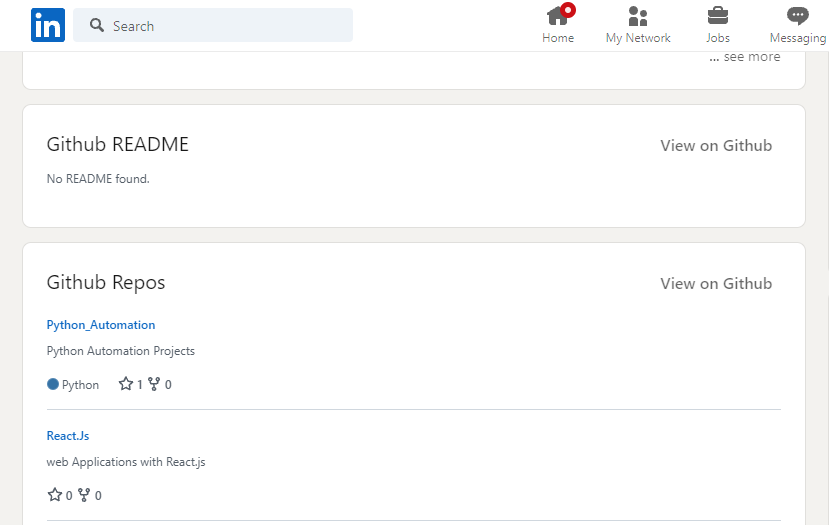

# github-viewer-for-linkedin

An extension that gets a user's README and top repos from Github and renders them on their LinkedIn page.



## Features

- Auto-runs when viewing a user's page on LinkedIn, retrieves their README and repos from Github via the GraphQL API, and renders them on the page
- Auto-guesses the user's Github username from their LinkedIn profile
  - **Note**: Current implementation is simple; the extension gets the github url from the 'Contact Info' section of the user's LinkedIn page. If no url is found, it shows 'Not found'. Future implementation will be a bit exhaustive by including a search page with the user's name, and an option to search a github username/url directly

## Roadmap

- [ ] show search page: textbox, auto-search user's name (+use regex to extract username if url)
- [ ] browser cache
- [ ] popup main window: toggle auto-load on/off
- [ ] tests
- [ ] api/server cache

## Run extension (locally)

- Clone the repo

```sh
git clone https://github.com/tawn33y/github-viewer-for-linkedin.git
cd github-viewer-for-linkedin
```

- Create [API auth token](https://docs.github.com/en/graphql/guides/forming-calls-with-graphql#authenticating-with-graphql)

- Create a `.env` file in cloned repo folder and paste the following (update `your-token` accordingly):

```txt
GITHUB_AUTH_TOKEN=your-token
```

- Install deps & build

```sh
npm i
npm run build

# alternatively, monitor for any changes & automatically rebuild
npm start
```

- Open Chrome and go to the following URL: [chrome://extensions](chrome://extensions)
- Enable Developer mode, click on `Load unpacked` and select the cloned repo folder
- Open a person's LinkedIn page to see the magic :)

## Helpful links

- [Github GraphQL API Explorer](https://docs.github.com/en/graphql/overview/explorer)
- [Awesome GitHub Profile README](https://github.com/abhisheknaiidu/awesome-github-profile-readme)

## A small note on getting a user's readme

This is proving to be an unnecessary pain, because of: **formatting (CSS)**.

### 1) Via API (graphql)

Pros:

- Lightweight, direct

Cons:

- Unable to render g-emoji
- Lacking github styling

```graphql
query User($login: String!) { 
  user (login: $login) {
    readme: repository (name: $login) {
      object(expression: "HEAD:README.md") {
        ... on Blob {
          text
        }
      }
    }
  }
}
```

### 2) Via direct url

Pros & Cons similar as above, more or less.

```txt
https://raw.githubusercontent.com/some-username/some-username/master/README.md

// if not found, try main branch

https://raw.githubusercontent.com/some-username/some-username/main/README.md
```

### 3) Via puppeteer or playwright

Pros:

- Super clean, gets HTML exactly as is on Github page

Cons:

- Heavy
- Needs to run on server, cannot run directly on browser

```js
// manual repro steps:

// 1: open url of user: https://github.com/some-username

// 2: get html, copy, & save in file.html
document.querySelectorAll('.flex-shrink-0 > div > .position-relative > .Box > .Box-body > .markdown-body')[0].innerHTML
```

```html
<!-- 3: search for all instances of "\n" and replace with blanks "" -->

<!-- 4: wrap around `article` tag -->
<article class="markdown-body entry-content container-lg f5" itemprop="text" style="margin: 20px">
-- insert copied html --
</article>

<!-- 5: add css tags -->
<link crossorigin="anonymous" media="all" integrity="sha512-d4XC7S3D2O/G0TvZjbbtWpDgCLyqvsXCX4K0DUJVfSwpV8ySOlchU43C/9mcyyHtCnczq4eoCl/e3fzC9uXxGA==" rel="stylesheet" href="https://github.githubassets.com/assets/light-7785c2ed2dc3d8efc6d13bd98db6ed5a.css">
<link crossorigin="anonymous" media="all" integrity="sha512-aajwIFrGqLg5i21YYM1mFURRwy/oOfXk9Qqddi1wxlCujXDL2CL0nSLQhGqN+R3Hw4vn/mUZc1ztEY426nRXug==" rel="stylesheet" href="https://github.githubassets.com/assets/frameworks-69a8f0205ac6a8b8398b6d5860cd6615.css">
<link crossorigin="anonymous" media="all" integrity="sha512-c7vfDk7/ICqO3N8ki8daSNtsngVAk61yLMU/bLWHGJ7oWxb5PMKkkpw9+xlalFL6gJusxQQZrMrcoDM0Id2Jgg==" rel="stylesheet" href="https://github.githubassets.com/assets/behaviors-73bbdf0e4eff202a8edcdf248bc75a48.css">

<!-- 6: open file in browser; should work OK! -->
```

## Pull Requests

Any and all PRs are open.
